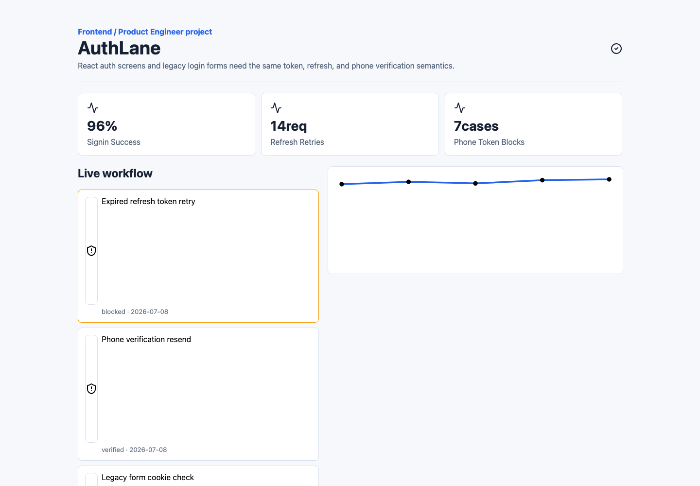

# AuthLane Workspace

신규 React 인증 화면과 레거시 로그인 폼이 같은 세션/토큰 갱신 규칙을 사용하도록 만든 인증 관리 프로젝트입니다.

## 저장소 구성

- FE: [`authlane-fe`](https://github.com/authlane-labs/authlane-fe)
- BE: [`authlane-be`](https://github.com/authlane-labs/authlane-be)
- 개인 공개 미러: https://github.com/cyjoon68/authlane-workspace
- 기본 브랜치: `develop`

## 핵심 기능

- 로그인/토큰 갱신 흐름
- 휴대폰 인증 상태 표시
- refresh token 재사용 차단 흐름
- React 화면과 jQuery/Ajax 레거시 폼의 인증 API 통합
- MVC 구조 기반 인증 controller/service/repository 분리

## 화면



## 기술 스택

- Frontend: React, TypeScript, ky, TanStack Query, jQuery
- Backend: Python, Flask, SQLAlchemy 2.0 Async Mode
- Database: MariaDB
- Infra/Test: Docker Compose, OpenAPI, pytest, k6, Playwright

## 실행

```bash
git submodule update --init --recursive

cd authlane-fe
npm install
npm run dev

cd ../authlane-be
python3 -m venv .venv
. .venv/bin/activate
pip install -r requirements.txt
pytest
```

## 데이터 흐름

```text
React Auth UI / Legacy Login
  -> ky or Ajax adapter
  -> Flask Controller
  -> Service
  -> SQLAlchemy Async
  -> MariaDB
```
